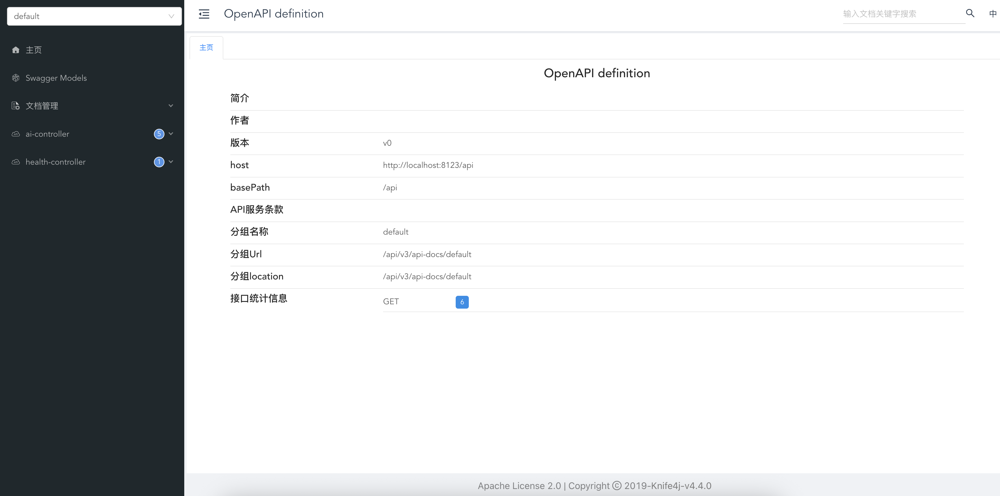

<h1 align="center" style="width: 60%; margin: auto; font-weight: 700; border: 0">AI 超级智能体</h1>
<h2 align="center" style="width: 20%; margin: auto; font-weight: 700; border: 0">初晨</h2>

> 本项目主要是以 SpringAI 为核心，熟悉各种 API 的使用，其中包括 ARG 知识库和向量数据库的使用、工具调用（Tool Calling）、MAP 的使用以及自己开发等。现代 AI 常用的技术栈都有实现以及使用。是一个很好学习 AI 开发的项目。

## 项目介绍
本项目是基于 Java21+ 的 SpringBoot3 项目。主要侧重于 AI 的应用的开发以及 AI 工具的使用。以开发一个旅游 AI 智能体为业务需求进行业务开发。主要通过 [阿里云百炼](https://bailian.console.aliyun.com/?spm=5176.29619931.J_AHgvE-XDhTWrtotIBlDQQ.13.74cd521cHjEgYu&tab=home#/home) 平台使用的阿里的开源模型进行的开发测试，当时也可以通过修改配置使用 Ollama 启动本地大模型进行使用。核心是使用 [SpringAI](https://java2ai.com/docs/1.0.0-M6.1/overview/?spm=4347728f.202d5c4a.0.0.56fd4bedn5t0R6) 框架进行各种的功能的开发：`AI 大模型的调用`、`自定义拦截器`、`上下文持久化`、`结构化输出`、`ARG 知识库的开发`、`Tool Calling `工具的开发以及使用第三方` MCP` 服务并学会自己开发一个 MCP 服务。 

还使用了 SSE 技术实现流式版本的 AI 对话服务接口，大量使用了 WebFlux 实现非阻塞异步操作，提高系统的并发处理能力。

具体来说可以掌握 ARG 应用开发，能过自主实现文档的 ETL、SpringAI 的向量数据库开发、各种 AI 应用工具的开发、掌握 AI 智能体的使用并了解相关概念能够自主开发自己的 AI 智能体。

## 核心技术

本项目根据现在的 AI 开发的市场趋向，使用了几乎所有需要掌握的技术栈：

- Prompt 工程和优化技巧
- Spring AI 核心特性：如自定义拦截器、上下文持久化、结构化输出
- RAG 知识库和向量数据库（使用云知识库、利用 PGVector 数据库搭建本地知识库）
- AI 工具的开发（Tool Calling 工具调用）
- MCP 模型上下文协议和服务开发
- AI 智能体 Manus 原理和自主开发（借鉴 OpenManus 项目设计思想）
- Ollama + SpringAI 本地大模型应用的开发

## 测试使用

### 1、导入项目

拉取本项目并用 IDEA 打开：

```shell
git clone git@github.com:timechuchen/chuchen-ai-agent.git
```

### 2、启动项目

1. 加载 Maven 依赖

2. 如果使用阿里云白练平台的话需要去 [阿里云百炼平台](https://bailian.console.aliyun.com/?spm=5176.29619931.J_AHgvE-XDhTWrtotIBlDQQ.13.74cd521clQkUqt&tab=app#/api-key) 获取一个调用模型的 dashscope 的 `api-key` 

3. 去 [阿里云](https://www.aliyun.com/product/rds/postgresql) 或者本地启动一个 `PostgreSQL ` 服务

4. 去 [百度 Search](https://www.searchapi.io/baidu) 申请一个 search-api 的 `api-key`

5. 如果需要的话去[高德地图](https://console.amap.com/dev/key/app) 去创建一个应用申请一个高德地图的`AMAP_MAPS_API_KEY` 的 `key` 

6. 编写配置文件的配置信息 [application-test.yml](src/main/resources/application-test.yml) 以及  [mcp-servers-test.json](src/main/resources/mcp-servers-test.json) ，并将 [application.yml](src/main/resources/application.yml) 中激活的配置文件改为 test：

   ```yaml
   spring:
     application:
       name: chuchen-ai-agent
     profiles:
       active: test
   ```

7. 启动   [ChuchenAiAgentApplication](src/main/java/com/chuchen/chuchenaiagent/ChuchenAiAgentApplication.java)  SpringBoot 启动类

### 3、访问接口文档进行基本的接口测试：

http://localhost:8123/api/doc.html



## 拓展优化

- [ ] 前端项目的开发对接优化
- [ ] 优化各种工具的具体实现（PDF 生成工具的结果可以转化为连接返回到结果等）
- [ ] 开发更多实用的 AI 工具